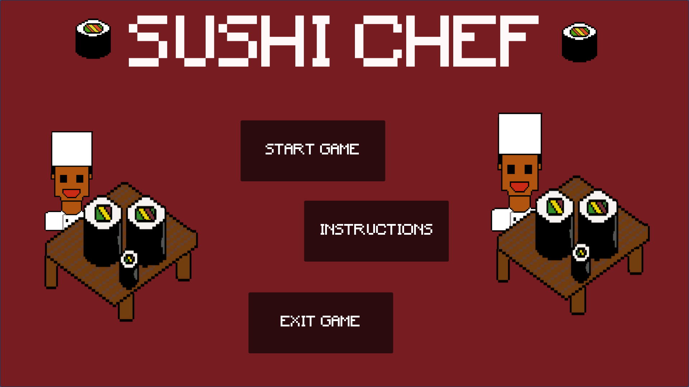
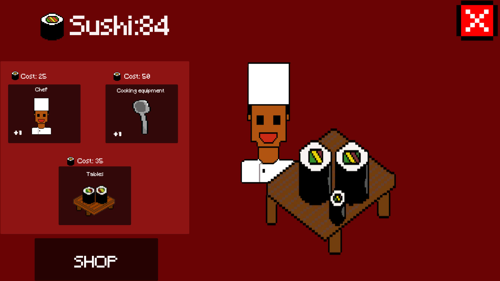

# Clicker Game
Digital Game prototype

#Sushi Chef

**Created:** 2021  
**Engine:** Unity  
**Style:** 2D, Pixel Art  
**Genre:** Clicker Game

---

##  What Is This Game?

Sushi Chef is a 2D clicker-style game where players produce sushi and grow their kitchen by purchasing additional chefs. Designed with player comfort in mind, the game uses a single currency, no timers, and a simple, readable UI to create a low-pressure, accessible experience focused on steady progression.

--
## Problem
- Many clicker and idle-style games overwhelm players with multiple currencies, timers, and complex systems early on, which can create unnecessary pressure and confusion
- Instead of feeling rewarding, progression can become stressful, especially for players unfamiliar with the genre
- The challenge was to design a clicker game that maintained engagement while prioritising clarity, accessibility, and player comfort, without sacrificing meaningful progression while also learning and understanding how data management systems work in a game prototype setting

---

## Solution

- Sushi Chef addresses this by simplifying the core loop to a single, intuitive interaction: clicking to produce sushi and reinvesting earned currency to increase production through additional chefs
- By removing timers and limiting the game to one currency, players can progress at their own pace without pressure
- Clear visual sprites and text feedback communicate currency growth, while dedicated instruction and settings screens support first-time players and accessibility needs
- The design intentionally focuses on functionality and flow, ensuring mechanics feel understandable and satisfying

---

## 🖼Screenshots

